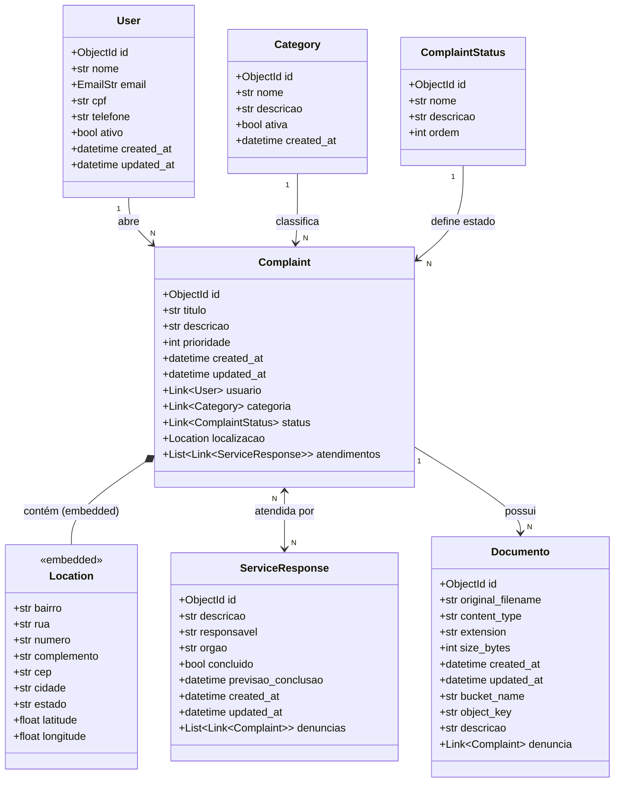

# Sistema de Gerenciamento de Denúncias Urbanas

API REST para registro e acompanhamento de denúncias urbanas, permitindo que cidadãos reportem problemas à prefeitura e acompanhem o atendimento.

## Stack

| Tecnologia | Função |
|---|---|
| **FastAPI** | Framework web assíncrono |
| **Beanie + Motor** | ODM assíncrono para MongoDB |
| **MongoDB** | Banco de dados principal |
| **MinIO** | Armazenamento de arquivos (S3-compatible) |
| **fastapi-pagination** | Paginação automática em todos os GETs |
| **Docker Compose** | Orquestração dos serviços |
| **uv** | Gerenciamento de pacotes Python |

---

## Como executar

### Pré-requisitos

- [Docker](https://www.docker.com/) e Docker Compose instalados

### 1. Clone e configure o ambiente

```bash
git clone <url-do-repositorio>
cd trab3-persistencia

# Copie o arquivo de variáveis de ambiente
cp .env.example .env
```

### 2. Suba todos os serviços

```bash
docker compose up --build
```

Aguarde até ver a mensagem `Application startup complete` nos logs da API.

| Serviço | URL |
|---|---|
| API (Swagger UI) | http://localhost:8000/docs |
| API (ReDoc) | http://localhost:8000/redoc |
| MinIO Console | http://localhost:9001 (usuário: `minioadmin` / senha: `minioadmin`) |
| MongoDB | `mongodb://localhost:27017` |

### 3. Popular o banco com dados de exemplo

```bash
# Execute o seed dentro do container da API
docker compose exec api python scripts/seed_data.py
```

O script insere:
- 12 categorias, 5 status
- 120 usuários
- 200 denúncias
- 110 atendimentos (com relação Many-to-Many)
- 160 documentos (metadados)

---

## Estrutura do Projeto

```
/
├── app/
│   ├── core/           # Configurações, DB, dependências
│   ├── models/         # Documentos Beanie + schemas Pydantic
│   ├── routes/         # Endpoints FastAPI (um arquivo por entidade)
│   ├── services/       # Lógica de negócio (MinIO)
│   └── main.py         # Ponto de entrada, lifespan, middlewares
├── scripts/
│   └── seed_data.py    # Popula o banco com Faker pt_BR
├── docker-compose.yml
├── Dockerfile
├── pyproject.toml
└── .env.example
```

---

## Endpoints Principais

### Denúncias
| Método | Rota | Descrição |
|---|---|---|
| `POST` | `/denuncias/` | Cria uma denúncia |
| `GET` | `/denuncias/` | Lista (paginado, com filtros) |
| `GET` | `/denuncias/{id}` | Busca por ID |
| `PUT` | `/denuncias/{id}` | Atualiza |
| `DELETE` | `/denuncias/{id}` | Remove |
| `GET` | `/denuncias/busca/texto?q=buraco` | Busca full-text |
| `GET` | `/denuncias/busca/por-data` | Filtro por intervalo de datas |
| `GET` | `/denuncias/agregacoes/por-bairro` | Contagem por bairro |
| `GET` | `/denuncias/agregacoes/por-categoria` | Contagem + join com categorias |
| `GET` | `/denuncias/agregacoes/por-status` | Contagem + join com status |
| `GET` | `/denuncias/agregacoes/detalhado` | JOIN de 4 coleções |

### Documentos (MinIO + MongoDB)
| Método | Rota | Descrição |
|---|---|---|
| `POST` | `/denuncias/{id}/documents` | Upload de arquivo |
| `GET` | `/denuncias/{id}/documents` | Lista documentos da denúncia |
| `GET` | `/documents/{doc_id}` | Metadados do documento |
| `GET` | `/documents/{doc_id}/download` | Download do arquivo |
| `PUT` | `/documents/{doc_id}` | Atualiza metadados |
| `DELETE` | `/documents/{doc_id}` | Remove do MinIO e MongoDB |

---

## Diagrama de Classes



---

## Variáveis de Ambiente

| Variável | Padrão | Descrição |
|---|---|---|
| `MONGODB_URI` | `mongodb://mongo:27017` | URI de conexão MongoDB |
| `MONGODB_DATABASE` | `denuncias_urbanas` | Nome do banco |
| `MINIO_ENDPOINT` | `minio:9000` | Endpoint do MinIO |
| `MINIO_ACCESS_KEY` | `minioadmin` | Chave de acesso MinIO |
| `MINIO_SECRET_KEY` | `minioadmin` | Segredo MinIO |
| `MINIO_BUCKET` | `denuncias-bucket` | Bucket padrão |
| `MINIO_SECURE` | `False` | HTTPS no MinIO |

---

## Consultas MongoDB Implementadas

| Tipo | Implementação |
|---|---|
| Busca por ID | `GET /denuncias/{id}` |
| Filtro por relacionamento | `GET /denuncias/?usuario_id=&categoria_id=` |
| Texto parcial / case-insensitive | `GET /denuncias/busca/texto?q=buraco` — usa `$text` index |
| Filtro por data (`$gte`, `$lte`) | `GET /denuncias/busca/por-data?data_inicio=&data_fim=` |
| Aggregation / contagem | `GET /denuncias/agregacoes/por-bairro` — usa `$group` |
| Join multi-coleção | `GET /denuncias/agregacoes/detalhado` — usa `$lookup` x 3 |
| Ordenação | Parâmetro `ordenar_por` em qualquer listagem |
